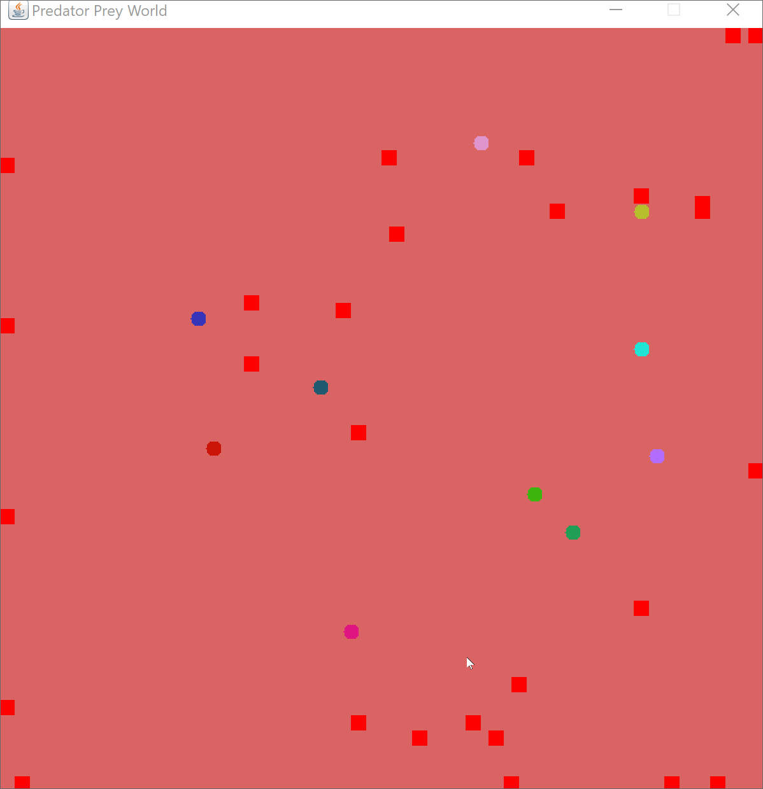

# Predator Prey Simulation

The project has been implemented to create a virtual world where pray and predator species interact on another for their survival. Both species exhibit their respective traits which they have developed evolutionarily. Out of many traits, there are two traits for each species that give the simulation the approximate imitation of the real world pray and predator interaction. The pray has artificial intellegence feature to minimize its detection by the predator. As the pray becoming smart, the Predator has aggressiveness feature to  offset their outstanding survival skills from one another. 

 Predator Rules

When the simulation starts, 5 predators (default value) are created at random locations in the world.
If a predator sees a prey within 15 squares of the direction it is facing (i.e., up, down, left, or right), then it moves towards that prey.
Otherwise, a predator has a five (5%) chance of turning in a random direction.
If a predator is adjacent to a prey (not including diagonals), then it eats the prey. (NOTE: see also prey rules when it can be eaten).
The predator has a one (1%) percent chance to reproduce every update, and it creates up to three offsprings.
The predator has a five (5%) percent chance to die every update.
NOTE: Feel free to change the nativity and death percentage if your simulation doesn’t look as interesting.

Prey Rules

When the simulation starts, 10 prey (default value) are created at random locations in the world.
Prey should always be added as a random colored circle, and always within the world bounds.
If a prey sees a predator within 10 squares of direction it is facing, then the prey faces the opposite direction and attempts to run two squares away (subsequent moves will only be one square, unless the prey sees another predator).
There is a ten (10%) percent chance of the prey turning in a random direction if no predator is in the visual field.
The prey can not be eaten by a predator if the color of the background is similar to the color of the prey.
The prey has a 10 percent of reproduction and has a 10 percent chance a mutation can happen (the offspring has a different color).

Extra features (evolutionary traits):

The added extra features to the species mimic their natural evolutionary inclination in the real world animal kingdom. In short word, the pray and predator have to have an evolutionary trait specific to their survival need. In consideration of demonstrating the real-world scenario in this respect, I have implemented the following functionalities in the simulation.

prayIntelligence function:

The pray has been featured with multiple case scenarios to avoid the possible predator attack. The pray analyzes the proximity of all four dimensions during the presence of a predator(s) and then takes a swift move through the most efficient and less risky path. It covers up to 20 edge cases, including the most sophisticated four 90' corners. Depend on the circumstances, the pray performs a random escaping turn if there is more than one escaping path detected.

predatorGhosting function:

The fact that the pray becoming evolutionarily smart for survival, I find it quite necessary in adding aggressive characteristics for the predator, which offset their outstanding survival skills from one another. The predator has a trait that allows overpowering the pray with a condition. If the pray present in the predator's detection with a precision of certain distance, the predator will lock that position and jump to the pray immediately.
